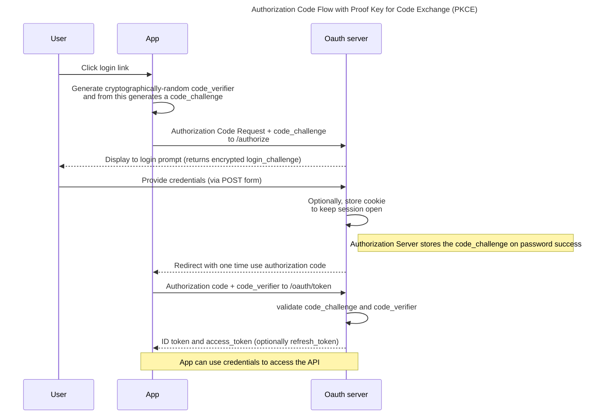

# RestApi package for CakePHP

Rest API for CakePHP 4.x

## Configuration

- Some configuration can be done using env variables (search for `env(` in the project to find usages).

- Some configuration when working with plugins can be done from the main configuration (`config/app.php` file).

  - Using the key `Swagger` is optional, but can be helpful to customize some directories (search for `read('Swagger` for details)
  - As sibling from the main `App` configuration use the namespace of the plugin followed by the word `Plugin`.

For example, if your plugin namespace is called Example, create the following config file:

```
return [
    'debug' => false,
    'App' => [ ... ],
    'Swagger' => [ ... ]
    'ExamplePlugin' => [
        'tablePrefix' => 'example_',
        'routePath' => '/api/v1',
    ],
];
```

The following configuration can be used:
- `tablePrefix`: (optional) in case you want to add a prefix for you database tables, e.g. `myplugin_users`. Can be empty string.
- `routePath`: Definition for the beginning of the path for all routes in the plugin

## Swagger
In order to make swagger UI with openapi description available, a new controller `SwaggerJsonController` must be
created, with the corresponding route definition. The method `getContent` can be overwritten in this controller
in order to add customization for the main spec info (title, description, version, etc.). Swagger generation can be
configured as described in the Configuration section above.

In any controller test the function `$this->skipNextRequestInSwagger()` can be used to do not add the next request.

## Authentication flow



(To see this diagram you need to
install [Mermaid](https://plugins.jetbrains.com/plugin/20146-mermaid)):

## License
The source code for the site is licensed under the **MIT license**, which you can find in the [LICENSE](../LICENSE/) file.
